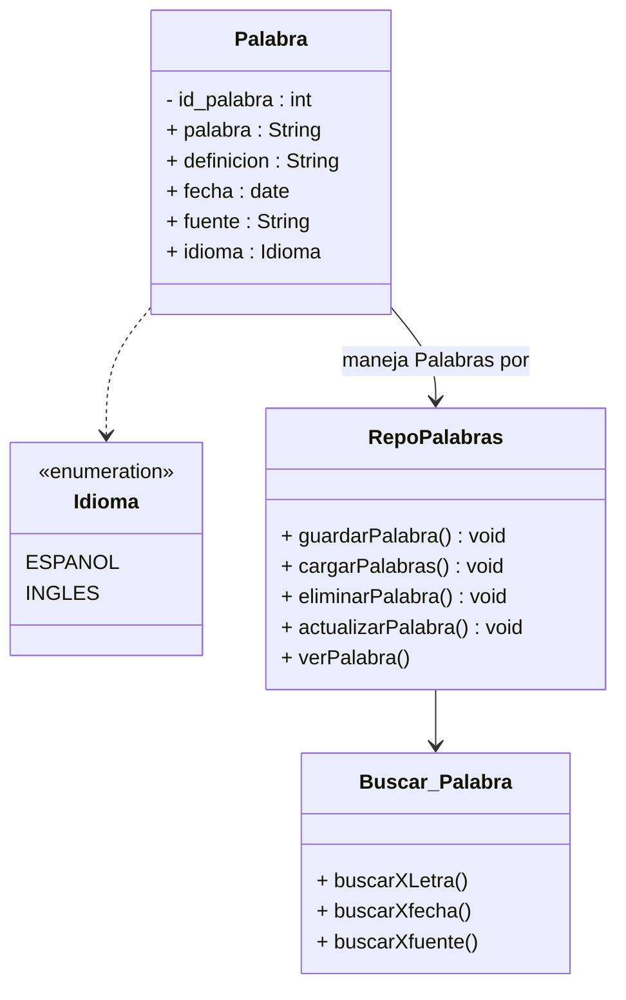

# UML

# Casos de uso

## CU-01 — Registrar palabra

**Actor:** Usuario

**Descripción:**  
El usuario registra una nueva palabra junto con su definición, fuente e idioma.

**Flujo principal:**
1. El usuario selecciona la opción para registrar una palabra.
2. El usuario ingresa la palabra.
3. El usuario ingresa la definición.
4. El usuario ingresa la fuente.
5. El usuario selecciona el idioma.
6. El sistema asigna automáticamente la fecha actual.
7. El sistema valida los datos ingresados.
8. El sistema guarda la palabra en el archivo correspondiente al idioma.

**Resultado:**  
La palabra queda almacenada con su palabra, definición, fuente, idioma y fecha.

---

## CU-02 — Consultar palabras

**Actor:** Usuario

**Descripción:**  
El usuario consulta las palabras que ya fueron registradas.

**Flujo principal:**
1. El usuario selecciona la opción para consultar palabras.
2. El usuario selecciona el idioma que desea consultar.
3. El sistema carga las palabras almacenadas.
4. El sistema muestra las palabras junto con sus datos asociados.

**Resultado:**  
El usuario puede visualizar las palabras y sus definiciones, fuentes y fechas.

---

## CU-03 — Buscar palabra

**Actor:** Usuario

**Descripción:**  
El usuario busca registros específicos entre las palabras almacenadas.

**Flujo principal:**
1. El usuario selecciona la opción de búsqueda.
2. El usuario selecciona el criterio de búsqueda.
3. El usuario ingresa el dato que desea buscar.
4. El sistema busca entre los registros almacenados.
5. El sistema muestra los resultados encontrados.

**Criterios de búsqueda posibles:**
- Palabra.
- Definición.
- Fuente.
- Fecha.

**Resultado:**  
El usuario obtiene los registros que coinciden con el criterio de búsqueda.

---

## CU-04 — Editar palabra

**Actor:** Usuario

**Descripción:**  
El usuario modifica los datos de una palabra que ya se encuentra almacenada.

**Flujo principal:**
1. El usuario selecciona una palabra almacenada.
2. El sistema muestra sus datos actuales.
3. El usuario modifica los datos que desea cambiar.
4. El sistema valida los nuevos datos.
5. El sistema guarda los cambios.

**Restricción:**  
La fecha de registro es asignada automáticamente por el sistema y no puede modificarse.

**Resultado:**  
La palabra queda almacenada con los datos actualizados.

---

## CU-05 — Eliminar palabra

**Actor:** Usuario

**Descripción:**  
El usuario elimina una palabra que ya se encuentra almacenada.

**Flujo principal:**
1. El usuario selecciona una palabra.
2. El sistema muestra los datos de la palabra.
3. El usuario confirma la eliminación.
4. El sistema elimina el registro del archivo correspondiente.

**Resultado:**  
La palabra deja de estar almacenada en el sistema.

---

## CU-06 — Ordenar palabras

**Actor:** Usuario

**Descripción:**  
El usuario organiza las palabras almacenadas según un criterio determinado.

**Flujo principal:**
1. El usuario selecciona la opción para ordenar palabras.
2. El usuario selecciona el criterio de ordenamiento.
3. El sistema organiza los registros.
4. El sistema muestra las palabras ordenadas.

**Criterios de ordenamiento posibles:**
- Palabra.
- Fecha.
- Fuente.

**Resultado:**  
Las palabras se muestran ordenadas según el criterio seleccionado.
