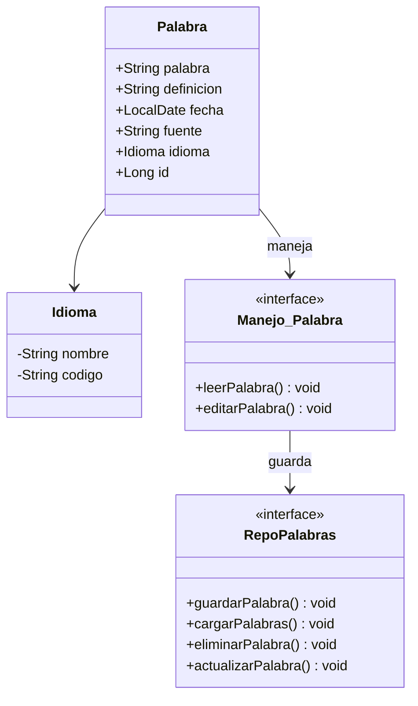

# UML

```mermaid
classDiagram

    class Palabra {
        +String palabra
        +String definicion
        +LocalDate fecha
        +String fuente
        +Idioma idioma
        +Long id
    }

    class Idioma {
        -String nombre
        -String codigo
    }

    class Manejo_Palabra {
        <<interface>>
        +leerPalabra() void
        +editarPalabra() void
    }

    class RepoPalabras {
        <<interface>>
        +guardarPalabra() void
        +cargarPalabras() void
        +eliminarPalabra() void
        +actualizarPalabra() void
    }

    Palabra --> Idioma
    Palabra --> Manejo_Palabra : maneja
    Manejo_Palabra --> RepoPalabras : guarda
```

# Casos de uso:

