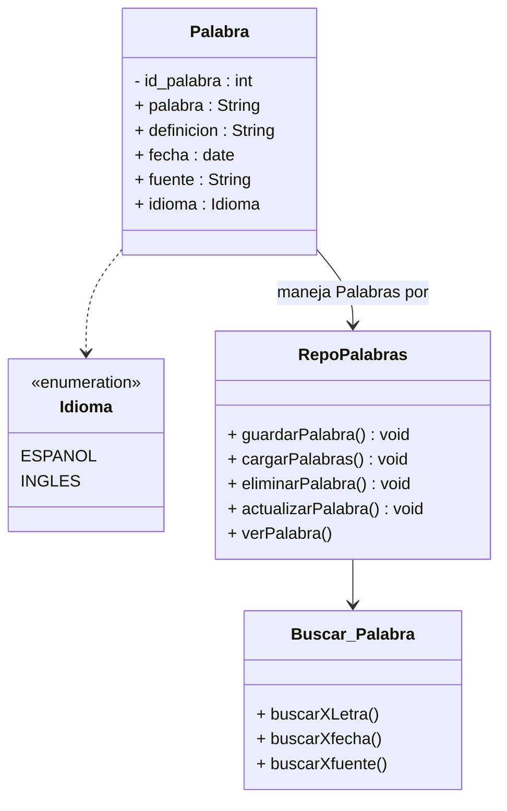

# UML

```mermaid
classDiagram
    class Palabra {
        - id_palabra : int
        + palabra : String
        + definicion : String
        + fecha : date
        + fuente : String
        + idioma : Idioma
    }

    class Idioma {
        <<enumeration>>
        ESPANOL
        INGLES
    }

    class RepoPalabras {
        + guardarPalabra() void
        + cargarPalabras() void
        + eliminarPalabra() void
        + actualizarPalabra() void
        + verPalabra()
    }

    class Buscar_Palabra {
        + buscarXLetra()
        + buscarXfecha()
        + buscarXfuente()
    }

    Palabra ..> Idioma
    Palabra --> RepoPalabras : maneja Palabras por
    RepoPalabras --> Buscar_Palabra
```

# Casos de uso:

