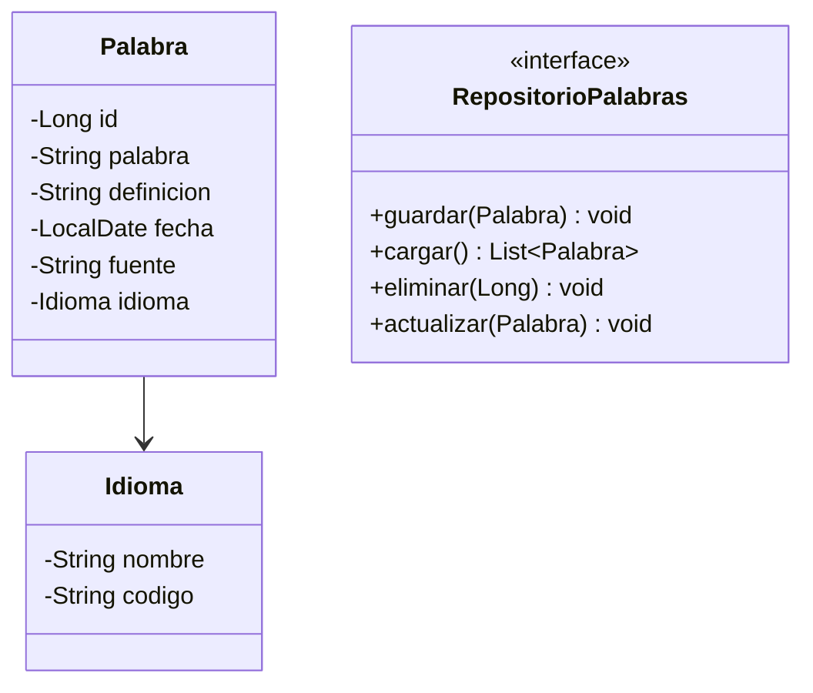

# UML

```mermaid
classDiagram

    class Palabra {
        -Long id
        -String palabra
        -String definicion
        -LocalDate fecha
        -String fuente
        -Idioma idioma
    }

    class Idioma {
        -String nombre
        -String codigo
    }

    class RepositorioPalabras {
        <<interface>>
        +guardar(Palabra) void
        +cargar() List~Palabra~
        +eliminar(Long) void
        +actualizar(Palabra) void
    }

    Palabra --> Idioma
```

# Casos de uso:

